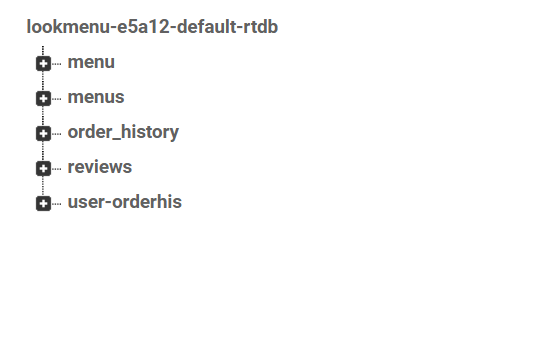

# LOOK MENU (UC4)
고객은 기본 메뉴와 추천 메뉴, 각 메뉴의 리뷰를 확인할 수 있다.

## 개발 환경
* Android Studio 4.1.3
* Firebase Realtime Database

## 앱 버전
* minSdkVersion 28
* targetSdkVersion 30


# 시스템


해당 앱은 사용자 정보를 기반으로 음식을 추천하고 리뷰를 제공합니다. 개발 초기에 SQLite로 구현하다가 FireBase RealTime DataBase를 채택하여 개발을 완료하였습니다.


## FireBase를 채택한 이유

1. 기존 SQLite는 Local 기반 DB라 사용자도 DB가 필요한 단점이 있고 데이터 삽입시 실시간으로 수신되지 않아 동시에 다른 유저가 사용시 오류가 발생할 수 있습니다.
2. FireBase는 비동기적으로 통신하여 실시간으로 통신이 가능하며 사용자는 DB가 필요없습니다. 또한 자체적인 기능으로 atomic한 연산을 보장합니다.
3. 직관적이고 사용하기 쉽다는 장점이 있습니다.


## DB 구조




## Table 구조

1. DB는 menu, order_history, reviews 테이블로 구성됩니다.
2. menu 테이블은 음식의 category, 음식 이름, 가격, 사용자 ID를 칼럼으로 갖습니다.
3. order_histroy 테이블은 사용자의 주문 기록이 저장됩니다. food(주문한 음식의 list이며 menu 테이블 칼럼과 같은 구성임.), 전체 주문 가격, 사용자 ID를 칼럼으로 갖습니다.
4. reviews 테이블은 사용자들의 리뷰 기록입니다. 리뷰기록 날짜, 음식 이름, 리뷰내용, 사용자 ID를 칼럼으로 갖습니다.


## 주요 기능

1. 사용자 정보 기반으로 음식 추천 기능
```java
ArrayList<Menu> makeRecommendations()
    {
        ArrayList<Menu> recommend = new ArrayList<>();
        HashMap<String, List<Menu>> orderDB = new HashMap<>();

        for(int i=0; i< this.userOrderHis.size(); i++)
        {
            List<Menu> menus = this.userOrderHis.get(i).getFood();
            for( Menu menu : menus){
                Log.d(TAG, menu.name);
                List<Menu> categoryMenu = orderDB.get(menu.category);
                if(categoryMenu == null){
                    categoryMenu = new ArrayList<>();
                }
                categoryMenu.add(menu);
                System.out.println(categoryMenu);
                orderDB.put(menu.category, categoryMenu);
            }
        }

        Map.Entry<String, List<Menu>> maxEntry = null;
        for (Map.Entry<String, List<Menu>> entry : orderDB.entrySet()) {
            if (maxEntry == null || entry.getValue().size() >= maxEntry.getValue().size()) {
                maxEntry = entry;
            }
        }

        if(maxEntry != null && maxEntry.getKey() != null){
            String maxKey = maxEntry.getKey();
            recommend.addAll(orderDB.get(maxKey));
        }

        return recommend;
    }


```
해당 기능은 사용자의 주문 기록중 가장 많이 주문된 카테고리를 찾아내어 해당 카테고리에 포함되는 음식을 반환하여 사용자의 식성에 맞는 음식을 추천해줍니다.


2. 음식 이름으로 리뷰 검색하기
```java
public void retrieveReviews(String food_name) // 이름으로 검색
    {
        db.child("reviews").orderByChild("food_name").equalTo(food_name).addListenerForSingleValueEvent(new ValueEventListener() {
            @Override
            public void onDataChange(DataSnapshot snapshot) {

                if (snapshot.exists()) {
                    for (DataSnapshot singleSnapshot : snapshot.getChildren()) {
                        //Object order = singleSnapshot.getValue();
                        Review a = singleSnapshot.getValue(Review.class);
                        //System.out.println(order);
                        review_history.add(a);
                    }
                }
                loadRecommendReviews();
            }

            @Override
            public void onCancelled(DatabaseError error) {

            }
        });
    }

```
사용자가 보고 싶은 음식의 이름을 검색하면 DB에서 해당 음식에 대한 리뷰들을 반환해줍니다.

