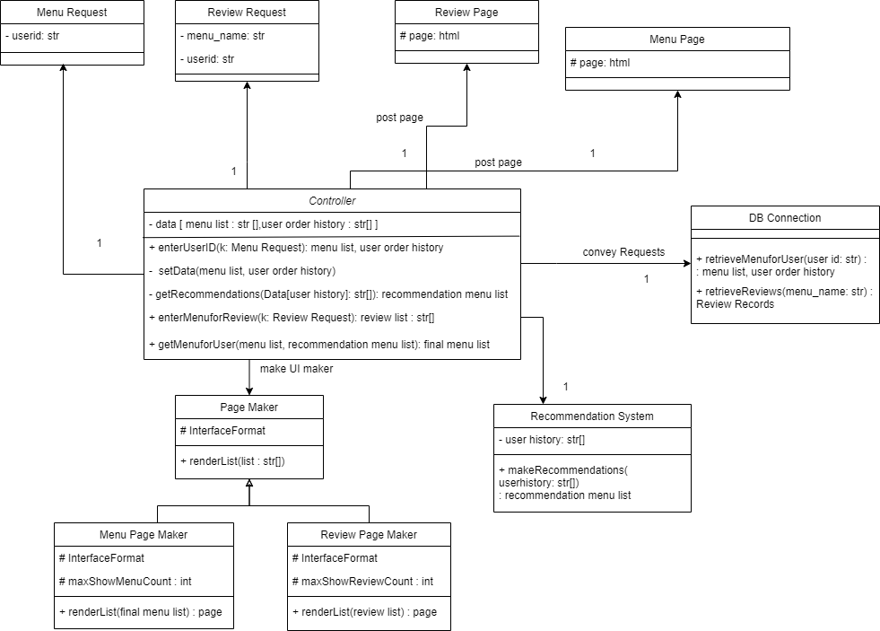
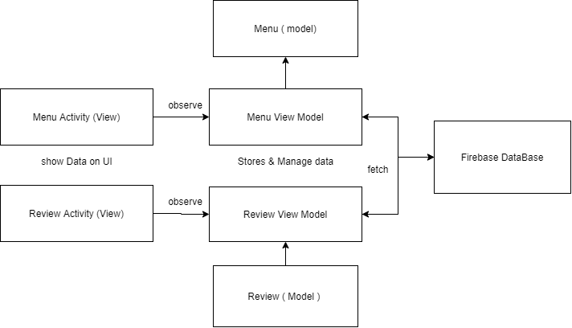
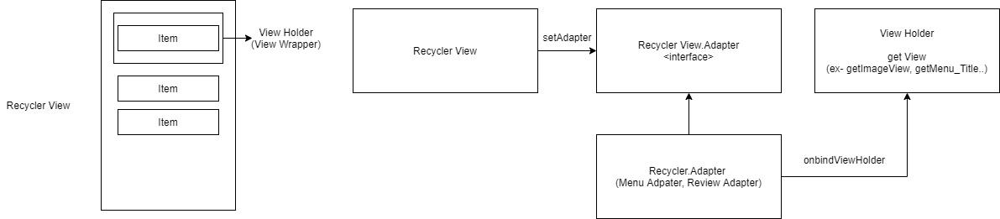

# LOOK MENU (UC4)
고객은 기본 메뉴와 추천 메뉴, 각 메뉴의 리뷰를 확인할 수 있다.

## 개발 환경
* Android Studio 4.1.3
* Firebase Realtime Database

## 앱 버전
* minSdkVersion 28
* targetSdkVersion 30

## 설계 변경 부분 및 적용 패턴

기존 클래스 다이어그램 


프로그램의 간략한 구조


* view model 
UI와 UI에 사용되는 데이터 분리
DB Connection 부분까지 맡게 됨

* Model 
도메인 모델에 사용되는 데이터 객체 정의

### Menu Request
가짜 코드로 대체

### Review Requst
String 매개변수로 대체

### Review Page와 Menu Page
activity_menu.xml과 activity_review.xml

Recycler View로 어댑터 패턴을 사용하여 구현


### Recommendation System
Singleton으로 구현
(Rcommendation System은 시스템 내 유일하기 때문)

```
private static final RecommendSystem instance = new RecommendSystem();

    private RecommendSystem(){}

    public static RecommendSystem getInstance(){
        return instance;
}
```


